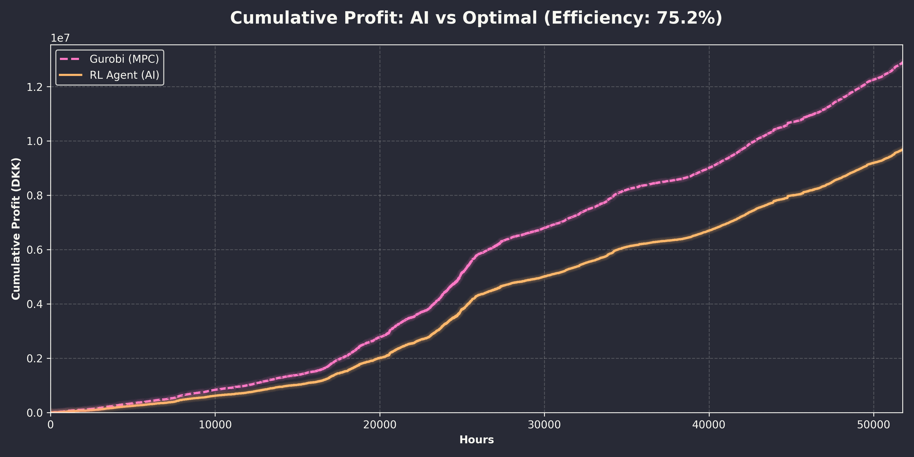
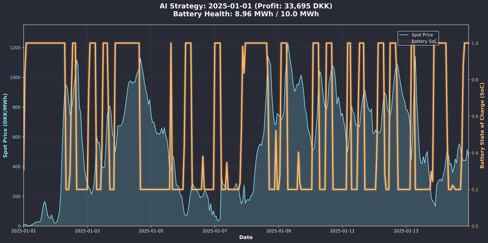

# 🔋 BatteryRL: AI vs. Optimal Control for Energy Arbitrage

### *Deep Reinforcement Learning Agent for Grid-Scale Battery Optimization*


*(Figure 1: Cumulative Profit Comparison (2019-2025). The RL Agent (Orange) maintains a consistent ~75% efficiency against the theoretical maximum calculated by Gurobi (Pink), even as total profits scale into the millions.)*

## 🚀 Executive Summary
This project implements a **Deep Reinforcement Learning (DRL)** agent capable of managing a grid-scale battery (10MWh) to maximize revenue in the Danish Day-Ahead power market (Nord Pool).

Unlike traditional optimization (Linear Programming) which is computationally heavy and brittle to forecast errors, this AI agent learns a **generalized trading policy** that adapts to market volatility, non-linear battery degradation, and efficiency losses in real-time.

**Key Achievements:**
* **Performance:** Generated **9.69 Million DKK** in simulated profit over ~6.5 years.
* **Efficiency:** Achieved **75.2%** of the theoretical upper bound set by a Rolling Horizon Gurobi Solver.
* **Robustness:** Successfully handled the 2022 "Energy Crisis" volatility without retraining, using dynamic feature scaling.

---

## 🧠 The Challenge: Beyond "Buy Low, Sell High"
Energy arbitrage seems simple, but automating it is complex due to:
1.  **Non-Linear Degradation:** Every charge cycle damages the battery. The agent must calculate if a trade is profitable enough to justify the asset depreciation.
2.  **Market Volatility (Distribution Shift):** Prices in 2022 were 10x higher than 2019. Hard-coded rules fail when market dynamics shift drastically.
3.  **Constraint Management:** Managing State of Charge (SoC), C-rates, and efficiency losses (90% round-trip) simultaneously.

## 🛠️ Technical Methodology

I developed a **Digital Twin** environment to simulate the physics and financial incentives of a grid battery.

| Component | Implementation | Details |
| :--- | :--- | :--- |
| **Algorithm** | **PPO (Proximal Policy Optimization)** | Utilized Stable Baselines 3. Chosen for its stability in continuous action spaces. |
| **Environment** | **Custom Gymnasium Env** | Simulates Li-Ion physics, capacity fading (aging), and round-trip efficiency losses. |
| **Benchmark** | **Gurobi (MIP)** | A "Rolling Horizon" Mixed-Integer Programming solver that calculates the mathematical "God Mode" profit for fair comparison. |
| **Feature Eng.** | **Relative Scaling (Z-Score)** | Inputs are normalized relative to the *rolling daily average*. This allows the agent to perceive a 4000 DKK spike in 2022 the same way it sees a 400 DKK spike in 2019, solving the "Distribution Shift" problem. |

---

## 📊 Detailed Performance Analysis

The agent was evaluated on a comprehensive dataset spanning **2019 to late 2025**.

### 1. Annual Profit Breakdown
The agent demonstrates consistent performance, actually **improving** its efficiency in later years as it "matures" within the simulation.


### 2. The Data Table
Exact performance metrics benchmarked against the mathematical optimum:

| Year | Days | RL Profit (DKK) | Optimal (Gurobi) | Efficiency |
| :--- | :--- | :--- | :--- | :--- |
| **2019** | 61.2 | 56,641 | 85,844 | 66.0% |
| **2020** | 365.0 | 582,257 | 777,019 | 74.9% |
| **2021** | 365.0 | 1,182,172 | 1,642,467 | 72.0% |
| **2022** | 365.0 | 2,892,817 | 3,876,786 | 74.6% |
| **2023** | 365.0 | 1,546,360 | 2,036,775 | 75.9% |
| **2024** | 364.0 | 1,749,683 | 2,298,244 | 76.1% |
| **2025** | 271.5 | 1,682,949 | 2,177,829 | **77.3%** |
| **TOTAL**| **~2356**| **9,692,878** | **12,894,964**| **75.2%** |

*> **Insight:** The agent maintained ~75% efficiency during the 2022 Energy Crisis, proving it successfully generalized to unseen high-variance market conditions.*

---

## 🔬 Visualizing Agent Behavior
Below is a 14-day snapshot of the agent's behavior in **January 2025**.


* **Blue Line:** Spot Price (DKK).
* **Orange Line:** Battery State of Charge (SoC).
* **Analysis:** The agent correctly identifies daily price peaks, discharging (orange drops) exactly when the blue line peaks. It also demonstrates "patience," holding charge during minor fluctuations and waiting for the global daily maximum.

---

## 💻 Installation & Usage
*Note: This repository contains the code structure. You must provide your own `train_data.csv` with a `SpotPriceDKK` column.*

1.  **Clone the repository:**
    ```bash
    git clone [https://github.com/YOUR_USERNAME/BatteryRL.git](https://github.com/PoccNocc/RL_Battery.git)
    cd BatteryRL
    ```

2.  **Install Dependencies:**
    ```bash
    pip install -r requirements.txt
    ```

3.  **Run Training:**
    ```bash
    python src/train.py
    ```

4.  **Run Benchmark:**
    ```bash
    python src/benchmark.py
    ```

## 🔮 Future Scope (Consulting)
This repository represents a robust Research & Development proof-of-concept. To move to production, the following modules are required:
* **Live Inference API:** Connect to Nord Pool / ENTSO-E APIs for real-time day-ahead prices.
* **Hardware Integration:** Modbus/TCP interface for Battery Management Systems (BMS).
* **Transformer Architecture:** Upgrading the Policy Network to a Transformer model to better capture long-term weekly seasonality.

---
**Author:** [Sébastien L'Huillier]
*Specialized in AI for Energy Systems & Smart Grid Optimization.*
